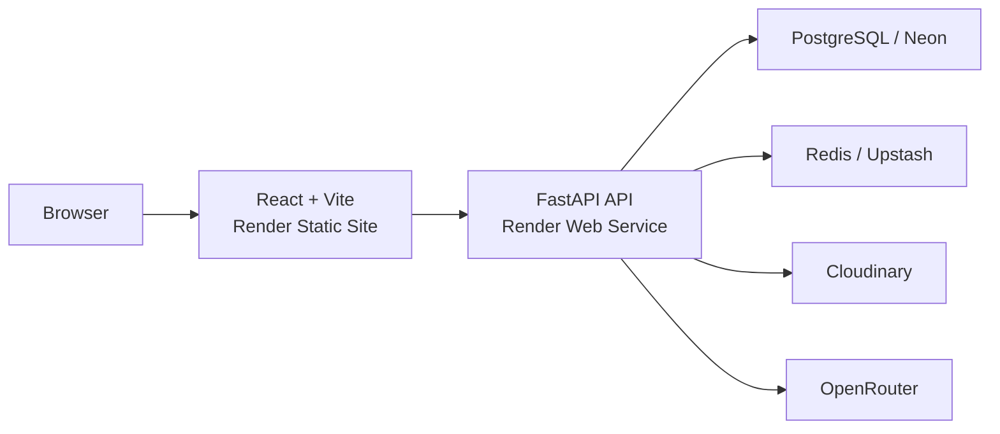

# Averlen

Averlen is a multi-tenant hospitality revenue intelligence platform for short-term rental teams. It brings booking-data ingestion, portfolio analytics, pricing recommendations, AI-assisted insights, notifications, and team access controls into one workspace.

The application includes a read-only demo workspace with seeded data so the product can be explored without changing the shared demo state.

## What Averlen includes

- Multi-tenant organizations with workspace-level data isolation
- JWT authentication with refresh-token rotation and session management
- Role-based access control for admins, revenue managers, analysts, and viewers
- Property management with persistent property photos
- CSV booking import with preview, column mapping, validation, idempotency, and import history
- Revenue and occupancy analytics across cities and properties
- Pricing recommendation generation, history, and status updates
- AI-assisted revenue insights through OpenRouter with a local fallback path
- Notifications, workspace invitations, access requests, and team management
- User profile management with persistent avatars
- Read-only seeded demo workspace
- Health and readiness endpoints for deployment monitoring

## Architecture



## Tech stack

### Frontend

- React
- TypeScript
- Vite
- Tailwind CSS
- TanStack Query
- React Router
- Recharts
- Zod

### Backend

- Python 3.11+
- FastAPI
- SQLModel / SQLAlchemy
- Alembic
- PostgreSQL
- Redis
- Pandas
- Pytest

### Production services

- Render — API and static frontend hosting
- Neon — PostgreSQL
- Upstash — Redis
- Cloudinary — persistent avatar and property-photo storage
- OpenRouter — optional LLM-backed insights

## Repository structure

```text
Averlen/
├── backend/                 FastAPI application
│   ├── alembic/             Database migrations
│   ├── app/                 API, services, models and core logic
│   ├── scripts/             Development/support scripts
│   ├── tests/               Backend test suite
│   ├── .env.example
│   ├── .env.production.example
│   ├── Dockerfile
│   ├── docker-compose.yml
│   ├── requirements.txt
│   └── requirements-dev.txt
│
├── frontend/                React application
│   ├── public/
│   ├── src/
│   ├── .env.example
│   ├── package.json
│   └── vite.config.ts
│
├── .gitignore
├── render.yaml              Render Blueprint
└── README.md
```

## Local development

### 1. Backend

From `backend/`, create a virtual environment and install dependencies:

```bash
python -m venv ../venv
```

Activate it, then install development dependencies:

```bash
pip install -r requirements-dev.txt
```

Copy `.env.example` to `.env` and configure your local values.

For fully local PostgreSQL and Redis:

```bash
docker compose up -d postgres redis
```

Apply migrations:

```bash
alembic upgrade head
```

Start the API:

```bash
uvicorn app.main:app --reload
```

The API runs at `http://127.0.0.1:8000` by default.

### 2. Frontend

From `frontend/`:

```bash
npm install
npm run dev
```

The Vite development server runs at `http://localhost:5173` by default.

For local development, `frontend/.env` can contain:

```env
VITE_API_BASE_URL=http://localhost:8000
```

## Environment configuration

Never commit real `.env` files or credentials. Use the supplied example files as templates.

Important backend variables include:

```env
DATABASE_URL=
REDIS_URL=
JWT_SECRET_KEY=
FRONTEND_ORIGINS=

OPENROUTER_API_KEY=
OPENROUTER_MODEL=

MEDIA_STORAGE_BACKEND=cloudinary
CLOUDINARY_CLOUD_NAME=
CLOUDINARY_API_KEY=
CLOUDINARY_API_SECRET=
CLOUDINARY_FOLDER=averlen
```

For local filesystem media storage instead of Cloudinary:

```env
MEDIA_STORAGE_BACKEND=local
```

## Demo workspace

Averlen includes a seeded read-only demo workspace intended for product exploration.

Demo users can browse properties, imports, analytics, pricing data, insights, notifications, and workspace information, while mutation operations are blocked so the shared demo remains consistent.

## Testing and quality checks

Backend:

```bash
cd backend
python -m pytest
```

Frontend:

```bash
cd frontend
npm run lint
npm run build
```

The production build uses route-level code splitting for the major application areas.

## Security highlights

- Access and refresh-token authentication
- Refresh-token rotation and session revocation
- HTTP-only refresh cookies
- Organization-level tenant isolation
- Role-based authorization
- Rate limiting on sensitive endpoints
- Upload validation and size limits
- Read-only demo enforcement
- Production secrets supplied only through environment variables
- API documentation disabled by default in production

## Deployment

A Render Blueprint is included at the repository root in `render.yaml`.

The production architecture is designed around:

```text
Render Static Site     -> frontend/
Render Web Service     -> backend/
Neon PostgreSQL        -> DATABASE_URL
Upstash Redis          -> REDIS_URL
Cloudinary             -> persistent media
OpenRouter             -> optional AI insights
```

The backend start command runs Alembic migrations before starting Uvicorn.

After deployment, verify:

```text
/healthz
/readyz
```

Production frontend and backend URLs must also be reflected in `VITE_API_BASE_URL`, `FRONTEND_ORIGINS`, and `SITE_URL`.
