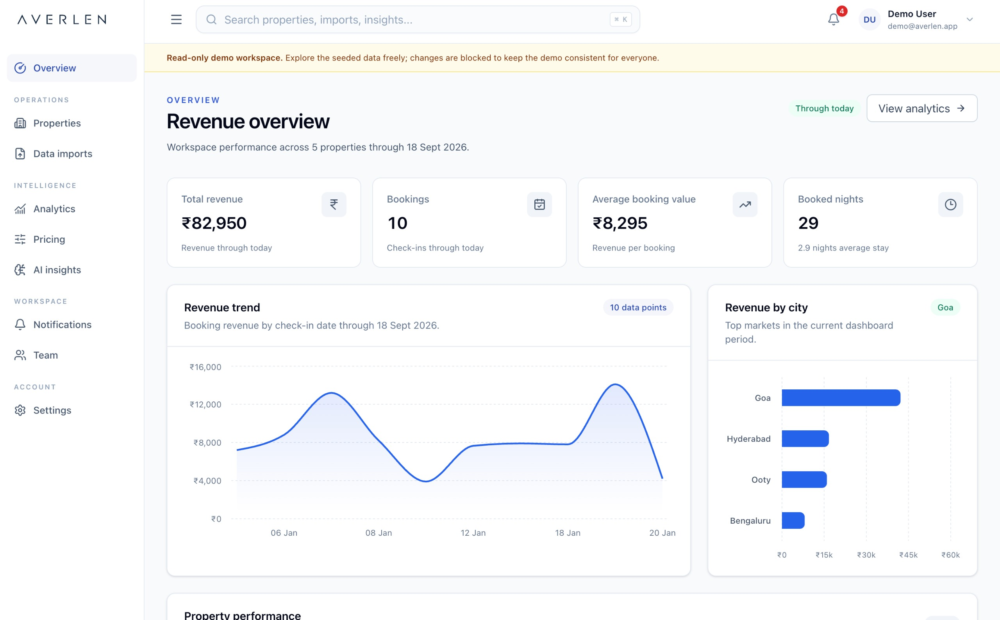
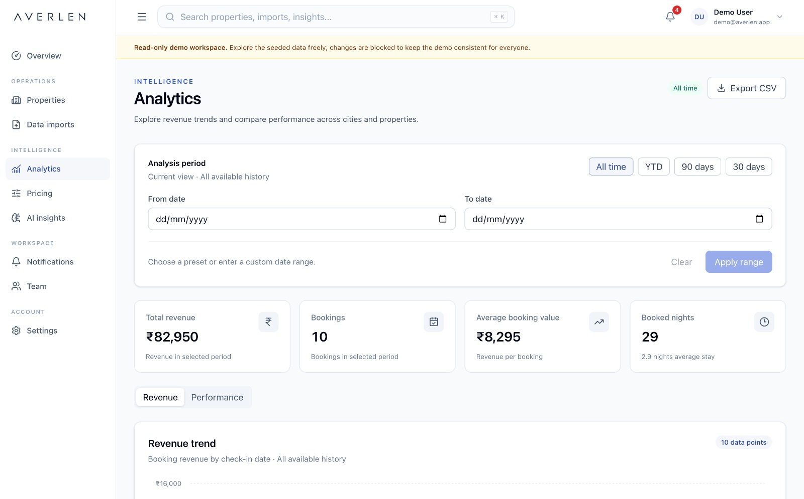
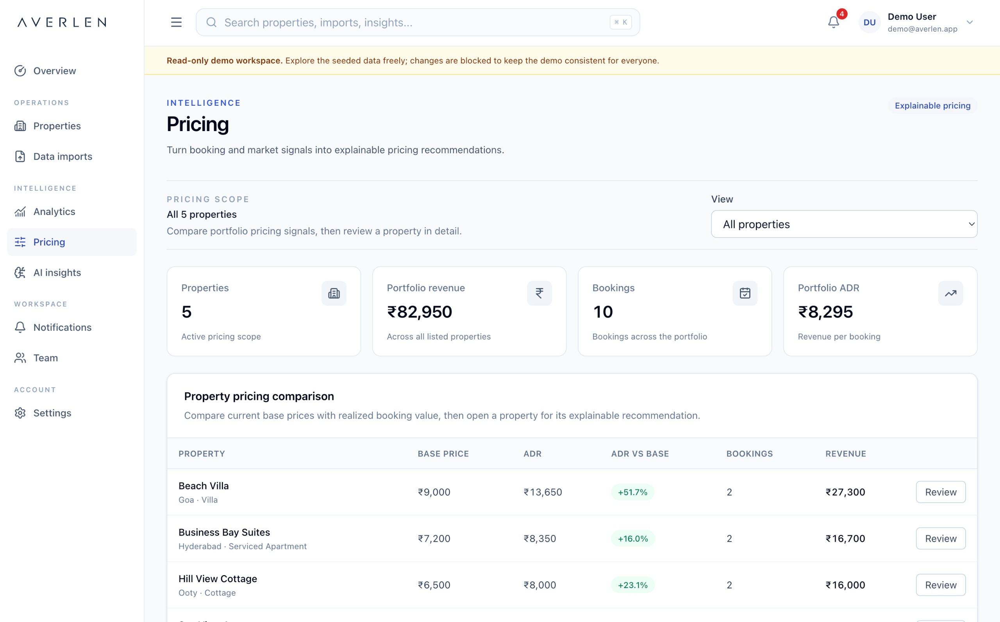
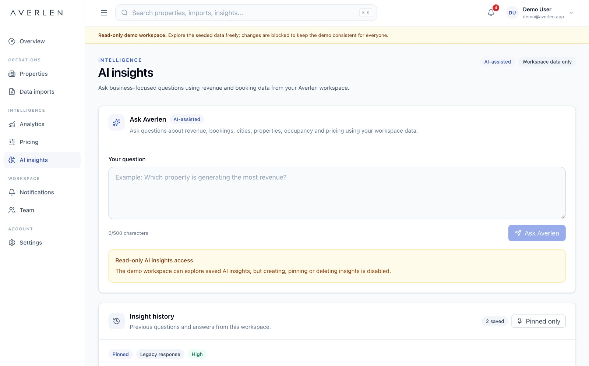
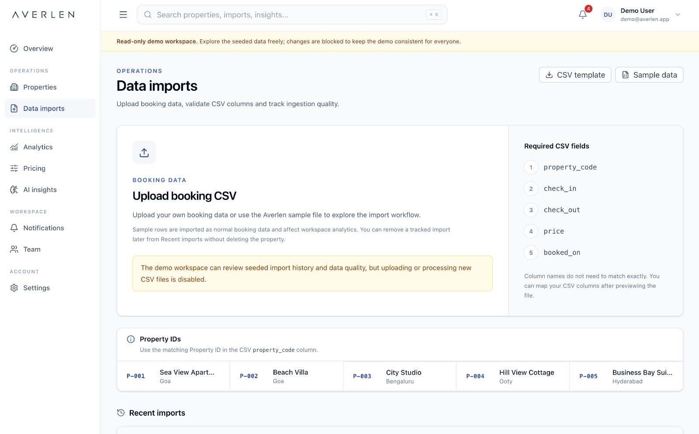
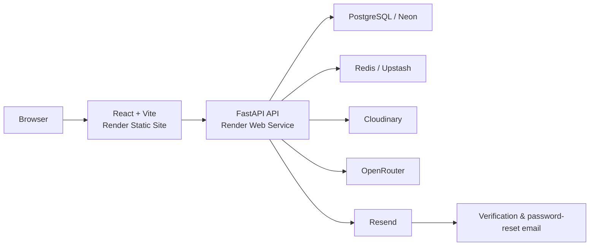

# Averlen

Averlen is a multi-tenant hospitality revenue intelligence platform for short-term rental teams. It combines booking-data ingestion, portfolio analytics, pricing recommendations, AI-assisted insights, notifications, team access controls, and secure account workflows in one application.

A read-only demo workspace with seeded data is also included so the product can be explored without changing shared demo state.

## Live app

[View Live](https://averlen-web.onrender.com)

## What Averlen includes

- Multi-tenant organizations with workspace-level data isolation
- JWT authentication with refresh-token rotation and session management
- Email verification and password-recovery flows
- Role-based access control for admins, revenue managers, analysts, and viewers
- Property management with persistent property photos
- CSV booking import with preview, column mapping, validation, idempotency, and import history
- Revenue and occupancy analytics across cities and properties
- Pricing recommendation generation, history, and status updates
- AI-assisted revenue insights through OpenRouter with a local fallback path
- Notifications, workspace invitations, access requests, and team management
- User profile management with persistent avatars
- Read-only seeded demo workspace
- Health and readiness endpoints for deployment monitoring

## Product preview

### Revenue dashboard

The dashboard gives teams a quick overview of portfolio performance, including revenue, occupancy, booking trends, and property-level signals.



### Analytics

Analytics provides portfolio, city, and property-level views so teams can understand revenue and occupancy performance over time.



### Pricing recommendations

Averlen can generate pricing recommendations, preserve pricing history, and track recommendation status such as accepted or rejected.



### AI-assisted insights

AI Insights turns portfolio and booking context into revenue-focused observations while preserving organization-level access controls.



### Data imports

Booking data can be imported through a CSV workflow with preview, column mapping, validation, job tracking, and import history.



## Architecture



## Tech stack

### Frontend

- React
- TypeScript
- Vite
- Tailwind CSS
- TanStack Query
- React Router
- Recharts
- Zod

### Backend

- Python 3.11+
- FastAPI
- SQLModel / SQLAlchemy
- Alembic
- PostgreSQL
- Redis
- Pandas
- Pytest
- Requests

### Production services

- Render — API and frontend hosting
- Neon — PostgreSQL
- Upstash — Redis
- Cloudinary — persistent avatar and property-photo storage
- OpenRouter — optional LLM-backed insights
- Resend — transactional email for account verification and password recovery

## Repository structure

```text
Averlen/
├── backend/
│   ├── alembic/             Database migrations
│   ├── app/                 API, services, models and core logic
│   ├── scripts/             Development/support scripts
│   ├── tests/               Backend test suite
│   ├── .env.example
│   ├── .env.production.example
│   ├── Dockerfile
│   ├── docker-compose.yml
│   ├── requirements.txt
│   └── requirements-dev.txt
│
├── frontend/
│   ├── public/              Static and brand assets
│   ├── src/
│   ├── .env.example
│   ├── package.json
│   └── vite.config.ts
│
├── .gitignore
├── render.yaml              Render Blueprint
└── README.md
```

## Local development

### Backend

From `backend/`, create a virtual environment:

```bash
python -m venv ../venv
```

Activate it, then install development dependencies:

```bash
pip install -r requirements-dev.txt
```

Copy `.env.example` to `.env` and configure your local values.

For fully local PostgreSQL and Redis:

```bash
docker compose up -d postgres redis
```

You can also point local development directly to managed services such as Neon and Upstash through `DATABASE_URL` and `REDIS_URL`.

Apply migrations:

```bash
alembic upgrade head
```

Start the API:

```bash
uvicorn app.main:app --reload
```

The API runs at:

```text
http://127.0.0.1:8000
```

### Frontend

From `frontend/`:

```bash
npm install
npm run dev
```

The Vite development server runs at:

```text
http://localhost:5173
```

For local development, `frontend/.env` can contain:

```env
VITE_API_BASE_URL=http://localhost:8000
```

## Authentication and account recovery

### Email verification

```text
Register
  -> verification email
  -> /verify?token=...
  -> email verified
  -> continue to sign in
  -> email prefilled on login
```

The verification page can also use:

```text
/verify?email=user@example.com
```

This keeps the user's email available for verification-related actions such as resending the verification email.

The legacy `/verify-email` frontend route can be kept temporarily for previously sent links.

### Password recovery

```text
Forgot password
  -> password-reset email
  -> /reset-password?token=...
  -> choose a new password
  -> sign in
```

Password-entry screens include show/hide controls across the authentication and account-security flows.

## Transactional email

Averlen uses Resend for transactional account emails.

Current email types include:

- Email verification
- Password reset

The shared email template uses the Averlen wordmark/logo.

For development, Resend's testing sender can be used. For production, configure a sender on a verified domain.

Example:

```env
EMAIL_FROM=Averlen <noreply@your-verified-domain.com>
EMAIL_REPLY_TO=your-reply-address@example.com
EMAIL_LOGO_URL=https://your-frontend.example.com/averlen-wordmark.png
```

`EMAIL_LOGO_URL` must point to a publicly accessible image because email clients such as Gmail cannot load images from local filesystem paths or `localhost`.

## Environment configuration

Never commit real `.env` files, credentials, API keys, or secrets. Use the supplied example files as templates.

Important backend variables include:

```env
DATABASE_URL=
REDIS_URL=
JWT_SECRET_KEY=

FRONTEND_ORIGINS=
FRONTEND_APP_URL=

OPENROUTER_API_KEY=
OPENROUTER_MODEL=

MEDIA_STORAGE_BACKEND=cloudinary
CLOUDINARY_CLOUD_NAME=
CLOUDINARY_API_KEY=
CLOUDINARY_API_SECRET=
CLOUDINARY_FOLDER=averlen

RESEND_API_KEY=
EMAIL_FROM=
EMAIL_REPLY_TO=
EMAIL_LOGO_URL=
REQUIRE_EMAIL_VERIFICATION=true
```

For local filesystem media storage instead of Cloudinary:

```env
MEDIA_STORAGE_BACKEND=local
```

## Demo workspace

Averlen includes a seeded read-only demo workspace intended for product exploration.

Demo users can browse properties, imports, analytics, pricing data, insights, notifications, and workspace information, while mutation operations are blocked so the shared demo remains consistent.

## Testing and quality checks

### Backend

```bash
cd backend
python -m pytest
```

Current backend test suite:

```text
131 passed
3 skipped
```

### Frontend

```bash
cd frontend
npm run lint
npm run build
```

The production build uses route-level code splitting for major application areas.

## Security highlights

- Access and refresh-token authentication
- Refresh-token rotation and session revocation
- HTTP-only refresh cookies
- Email verification before sign-in when enabled
- Password-reset flow with expiring reset links
- Organization-level tenant isolation
- Role-based authorization
- Rate limiting on sensitive endpoints
- Upload validation and size limits
- Read-only demo enforcement
- Production secrets supplied only through environment variables
- API documentation disabled by default in production
- Generic account-recovery responses to avoid exposing whether an email is registered

## Deployment

A Render Blueprint is included at the repository root in `render.yaml`.

The production architecture is designed around:

```text
Render frontend       -> frontend/
Render backend        -> backend/
Neon PostgreSQL       -> DATABASE_URL
Upstash Redis         -> REDIS_URL
Cloudinary            -> persistent media
OpenRouter            -> optional AI insights
Resend                -> verification and password-reset email
```

The backend start command runs Alembic migrations before starting Uvicorn.

After deployment, verify:

```text
/healthz
/readyz
```

Production frontend and backend URLs must also be reflected in:

```text
VITE_API_BASE_URL
FRONTEND_ORIGINS
FRONTEND_APP_URL
EMAIL_LOGO_URL
```

For production email delivery, verify that:

- `RESEND_API_KEY` is configured on the backend service
- `EMAIL_FROM` uses the intended sender
- the sending domain is verified in Resend when using a custom domain
- `EMAIL_LOGO_URL` points to a publicly accessible image
- verification and password-reset links resolve to the production frontend
